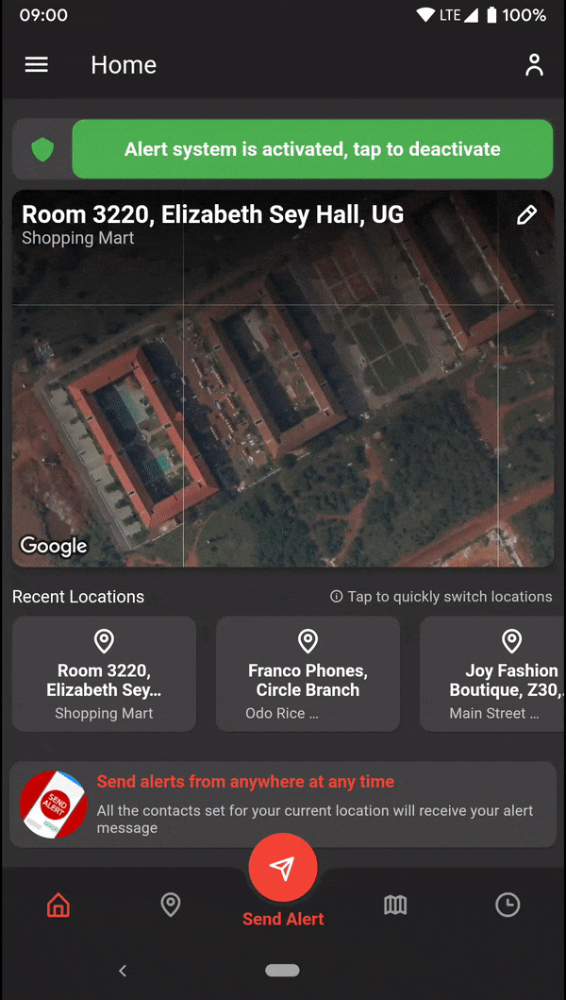
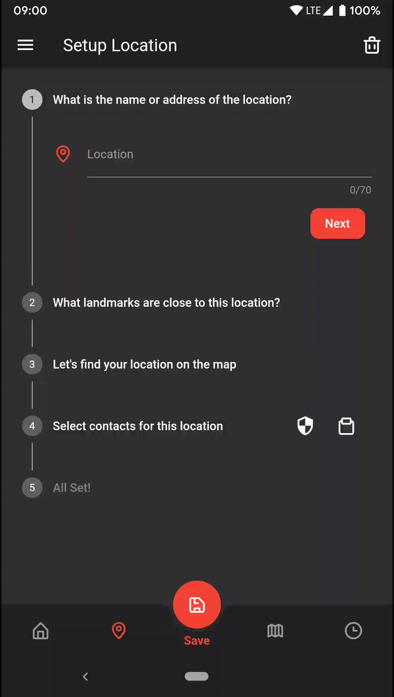
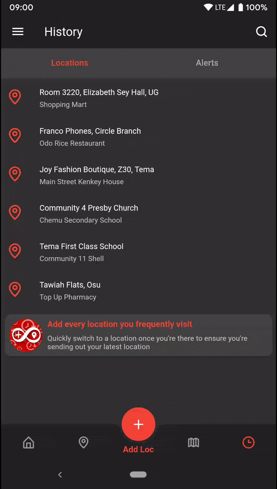
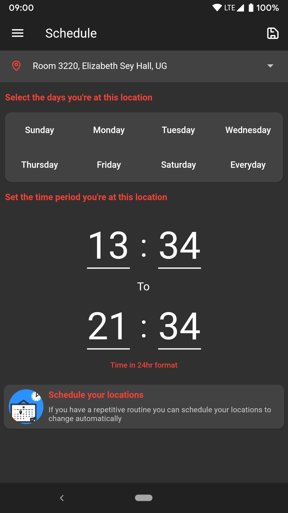
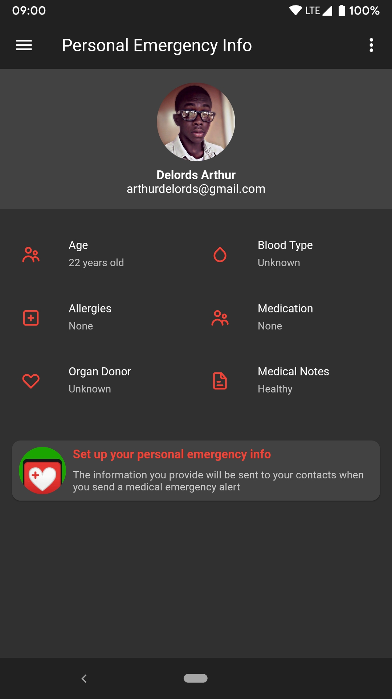
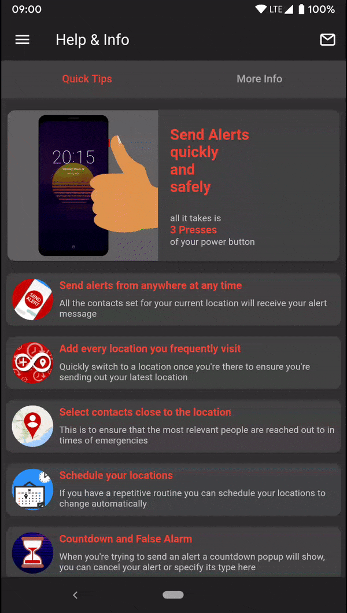

# SecAlert
A Personal Emergency Alert App

### About

SecAlert is a personal emergency alert app that allows the user to specify several locations they frequently visit along with four contacts specific to those locations. In the event of an emergeny, like a robbery, fire or medical situation, An alert can easily be triggered and a custom message based on the user's current location will be sent to that location's contacts. 

### Showcase

| Homepage | | Locations Setup |
| :---: | --- | :---: |
|  ||   |
| Homepage with convenient alert system switch, || Fast and simple location and contacts |
| recent locations and "Send Alert Button" || setup process |

| Map || History |
| :---: | --- | :---: |
|  ||  |
| Full map to view and change || History page to view all locations added  |
| each location's GPS coordinates || as well as recent alerts received and sent |

| Schedule || User |
| :---: | --- | :---: |
|  ||  |
| Schedule automatic location  || User can specify various health |
| switching for more control || related info for first responders |

| Help & Info | 
| :---: |
|  |
| Handy tips and recommendations |
| to get the best from SecAlert |
